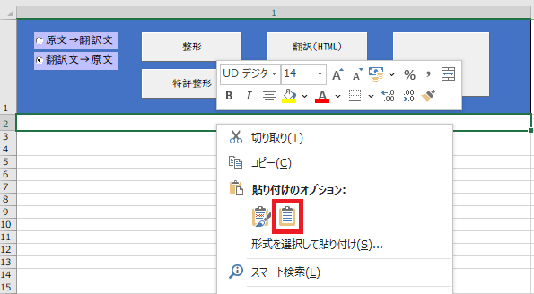
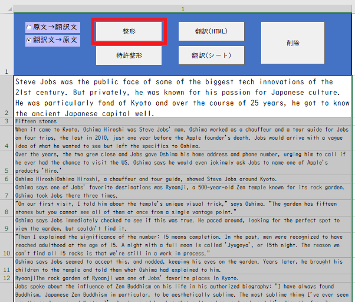
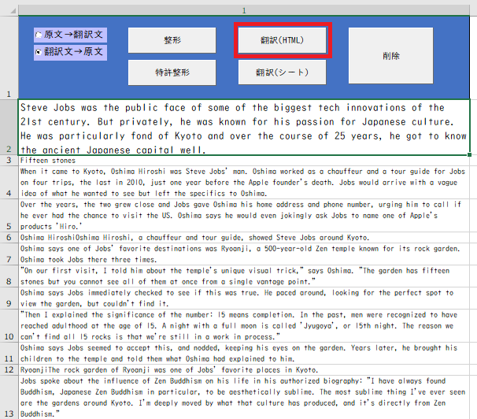
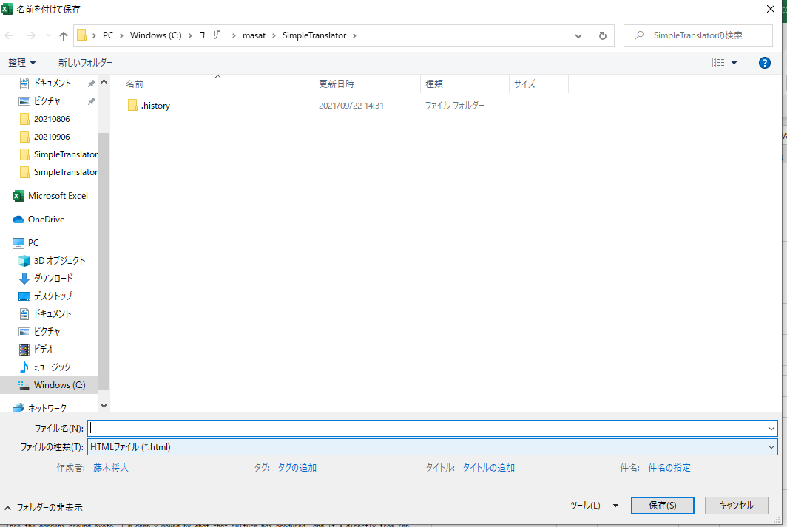
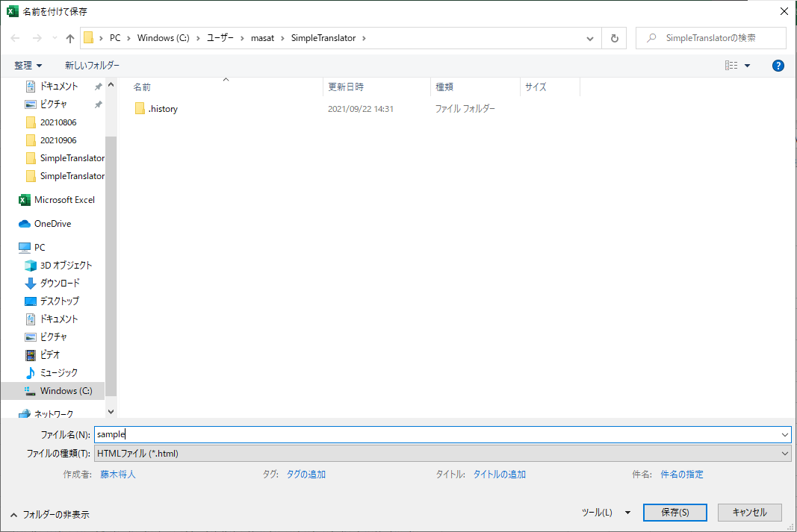
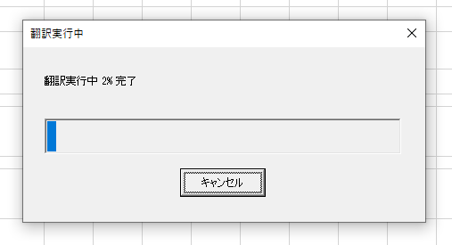
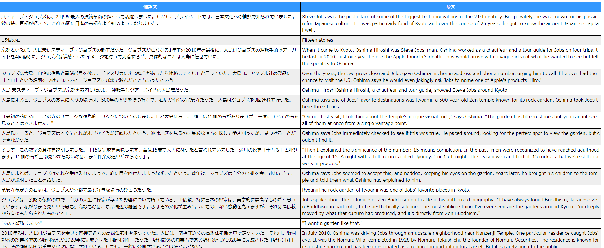

# SimpleTranslator(英語翻訳ツール)

Excel に貼り付けた外国語を Selenium Basic と DeepL でお手軽に翻訳してくれるツールを作りました。

環境設定はお手軽ではないですが、一度、環境設定を済ませば Chrome Driver の更新以外は設定不要です。

## ■ 背景

現在は特許関連の仕事をしており、検索システムを利用して特許文献を検索しています。

検索結果として出力される特許文献は日本語だけでなく英語などの外国語の特許語文献もあり、

外国語の特許文献を読んで技術内容を理解することがあります。

## ■ 課題

外国語の特許文献の理解を補助するために検索システムには翻訳ツールが実装されていますが、

用意された翻訳ツールの翻訳精度が低く、外国語の特許文献の翻訳結果を理解するのに時間が掛かります。

## ■ 目的

翻訳ツールを利用して外国語の原文と DeepL で翻訳した翻訳文とを並べて表示することにより、

精度が高い翻訳文と原文とを比較できる翻訳ツールを提供することです。

## ■ 必要なもの

### OS

- Microsoft Windows 10

### ソフトウェア

- Google Chrome
- Microsoft Excel 2016 または Microsoft Excel 2019
- Selenium Basic
- Chrome Driver

## ■Selenium Basic を動作させるまでの環境設定

Selenium Basic がインストールされ、動作している環境なら以下は必要ありません。次に進んでください。

1. [SeleniumBasic をインストールして Excel(VBA)から Web スクレイピングを行うまでのチュートリアル][a]のページを開きます。
2. [上記記事][a]を参照して Selenium Basic をダウンロード＆インストールします。
3. [上記記事][a]を参照して Chrome Driver のダウンロードし、ダウンロードした Chrome Driver を Selenium Basic をインストールしたフォルダにコピー＆上書きします。
4. [上記記事][a]を参照して Selenium Basic の動作確認を行います。
5. 「.Net Fremework 3.5」がインストールされていないために起こるエラーが発生したときは、[上記記事][a]の一番下のリンクを参照して「.Net Fremework 3.5」をインストールします。
6. ここで「.Net Fremework 3.5」をインストールできないときは次の 7.の手順を実行します。
7. [Windows10 に.NET3.5 をインストールする方法！][b]のページを参照して「.Net Fremework 3.5」をインストールします。変更したレジストリの値を戻すまできっちりやってください。

## ■Simple Translator の使い方

1. [SimpleTranslator の zip ファイル](https://github.com/masatofujiki/SimpleTranslator/archive/refs/tags/v1.0.4.zip)← クリックしてダウンロードします。
2. [サンプルページ][c]を使って英文翻訳を行います。
3. 上記 1.でダウンロードした zip ファイルを解凍し、SimpleTranslator フォルダ内の SimpleTranslator.xlsm を開きます。
4. 表示順「原文 → 翻訳文」「翻訳文 → 原文」のどちらにするかのラジオボタンを選択します。
5. [サンプルページ][c]に表示された英文をマウスでなぞってコピーします。
6. Excel のシート A2 で右クリックし、「貼り付けのオプション」で左から 2 番目のアイコンを選びます。

7. 空白行を詰めるための整形ボタンを押します。

8. 翻訳(HTML)ボタンを押します。

9. 「名前を付けて保存」ダイアログが表示されます。

10. 名前を入力し保存します。ここでは「sample」と入力し「保存」ボタンを押します。

11. 翻訳が開始され、プログレスバーが表示されるのでしばらく待ちます。

12. 翻訳が完成するとブラウザが立ち上がり翻訳結果が出力されます。

13. 翻訳結果は HTML の形式でアプリケーションと同じ場所のディレクトリに作成されます。

## ■ 注意

※Google Chrome がアップデートされると Chrome Driver が動かなくなります。

※このときは[上記記事][a]を参照して Google Chrome のバージョンに合わせた Chrome Driver を上書き更新してください。

## ■ ダウンロードページ

1. [Selenium Basic](https://florentbr.github.io/SeleniumBasic/)
2. [Chrome Driver](https://chromedriver.chromium.org/downloads)

## ■ 参考ページ

1. [SeleniumBasic をインストールして Excel(VBA)から Web スクレイピングを行うまでのチュートリアル][a]
2. [Windows10 に.NET3.5 をインストールする方法！][b]
3. [サンプル][c]

[a]: https://lil.la/archives/3436
[b]: https://bgt-48.blogspot.com/2019/04/windows10net35.html
[c]: https://www3.nhk.or.jp/nhkworld/en/news/backstories/1622/
