# SimpleTranslator(English translation tool)

[日本語 README はこちら][a]

[Click here for Selenium Basic Version][g]

I created a tool to easily translate a foreign language pasted into Excel with Chrome Driver and DeepL. No special configuration is required, and no update of Chrome Driver is needed.

## ■ Background

I am currently working in a patent-related field and am using a search system to search for patent documents.

The patent documents that are output as search results are not only in Japanese but also in foreign languages such as English, and we sometimes read foreign language patent documents to understand the technical contents.

## ■ Theme

However, the translation accuracy of the translation tools provided is low, and it takes time to understand the translation results of foreign language patent documents.

## ■ Purpose

The idea is to provide a translation tool that can compare the translated text with the original text with high accuracy by displaying the original text in a foreign language and the translated text translated by DeepL side by side.

## ■ What you need

### OS

- Microsoft Windows 10 or Microsoft Windows 11

### Software

- Google Chrome
- Microsoft Excel 2016 or Microsoft Excel 2019
- Chrome Driver

## ■ How to use Simple Translator

1. [1.SimpleTranslator zip file][b] ← Click to download.

2. Unzip the zip file downloaded in step 1 above, and open SimpleTranslator.xlsm in the SimpleTranslator folder.

3. Select the language selection combo box.

   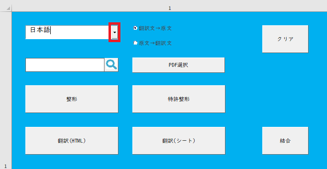

4. Select the target language.

   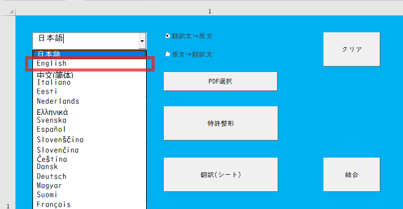

5. Select the radio button to choose the display order of "Translated Text → Source Text" or "Source Text → Translated Text".

   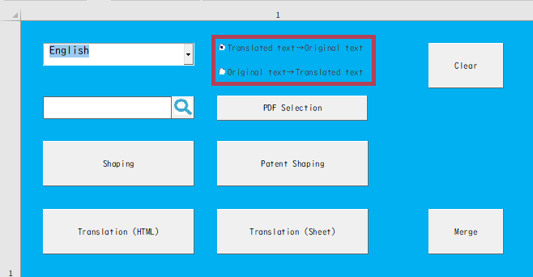

### How to use it in Web articles (For how to use it in patent documents and PDF, please skip this section and go to the following sections.)

6. Trace the English text displayed on [the sample page][c] with your mouse to copy it.

   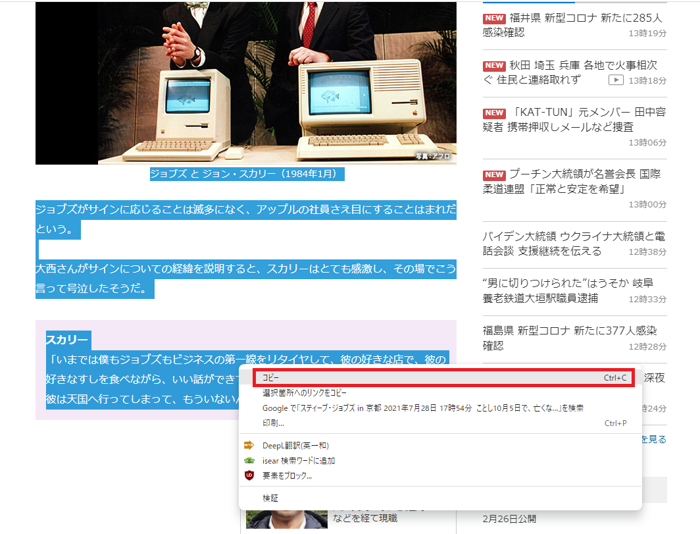

7. Right-click on sheet A2 in Excel, and select the second icon from the left under Paste Options.

   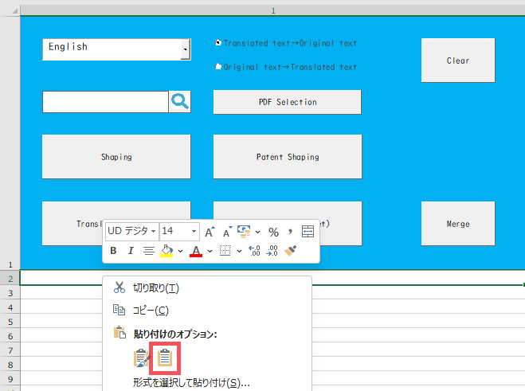

8. Press the "Shaping button" to fill in the blank lines.

   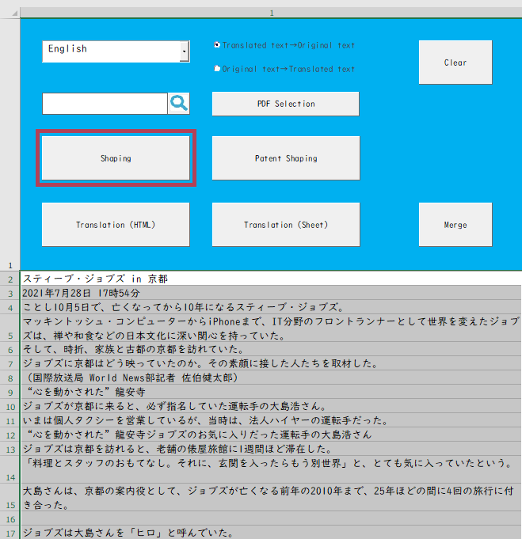

9. Press the "Translate (HTML)" button.

   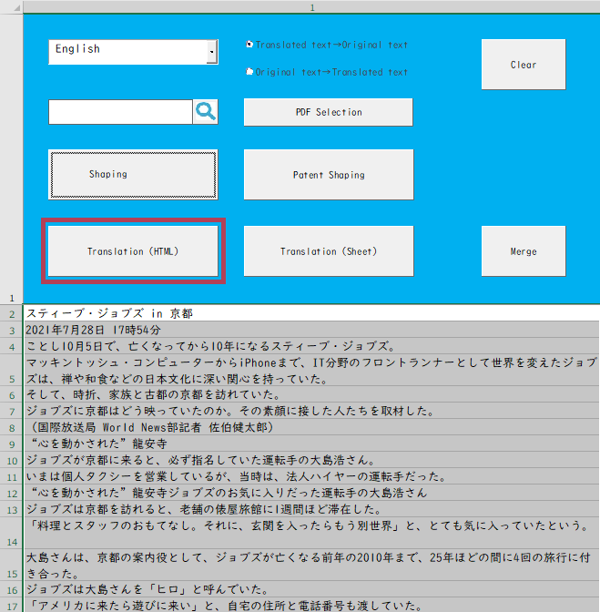

10. The "Save As" dialog box will appear.

    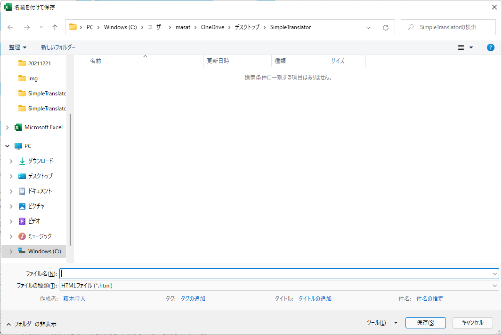

11. Enter a name and save the file. In this case, enter "sample" and click the "Save button".

    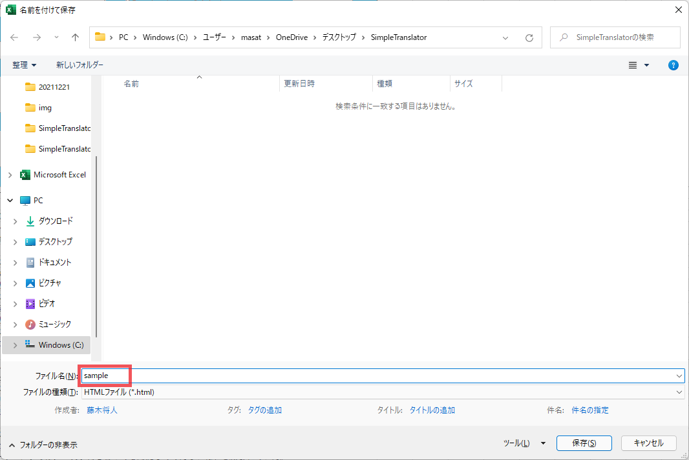

12. The translation will start and a progress bar will appear.

    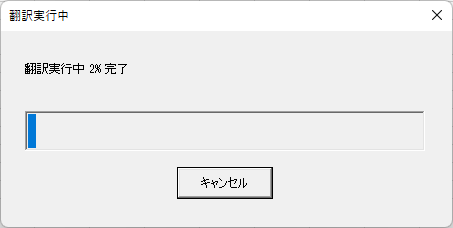

13. When the translation is complete, the browser will open and output the translation results.

    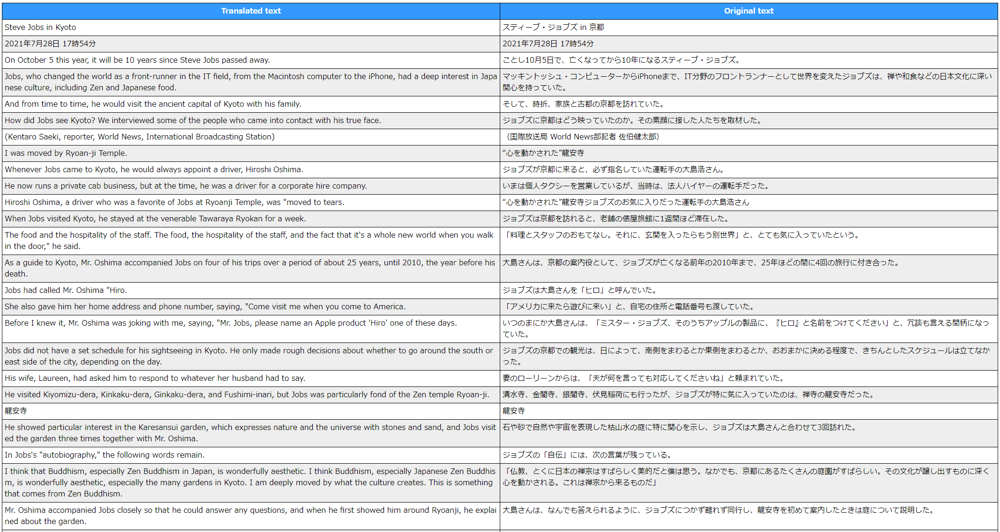

14. The translation results will be created in HTML format in a directory in the same location as the application.

## ■ Reference page

1. [sample][c]
2. [Scraping with Excel VBA without SeleniumBasic][e]
3. [[Selenium] I want to update WebDriver automatically even with VBA!][f]

[a]: https://github.com/masatofujiki/SimpleTranslator/blob/main/README_JA.md
[b]: https://github.com/masatofujiki/SimpleTranslator/archive/refs/tags/v1.3.0.zip
[c]: https://www3.nhk.or.jp/news/html/20210728/k10013161181000.html
[e]: https://qiita.com/uezo/items/66e20b064ffd5f239b9a
[f]: https://qiita.com/yamato1413/items/4b982aee46f28358fd39
[g]: https://github.com/masatofujiki/SimpleTranslator/blob/main/README_OLD.md
