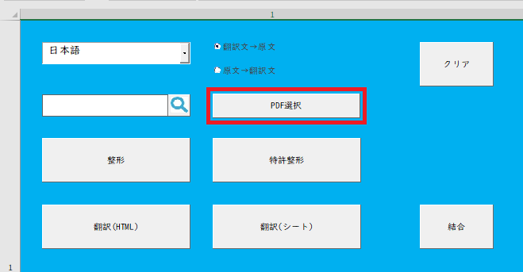
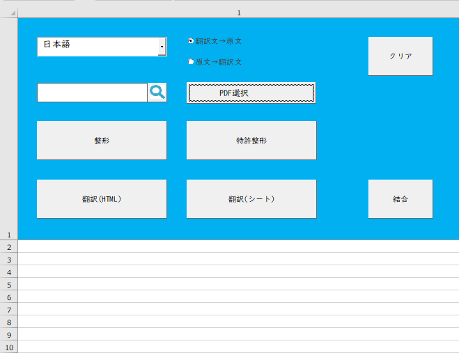
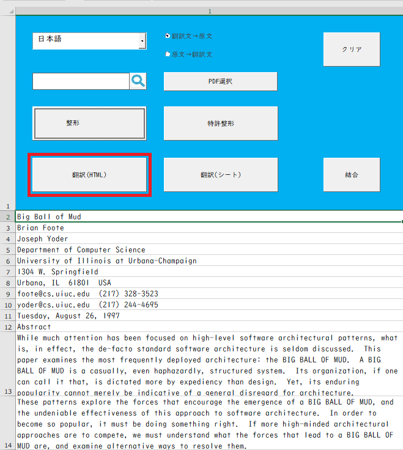
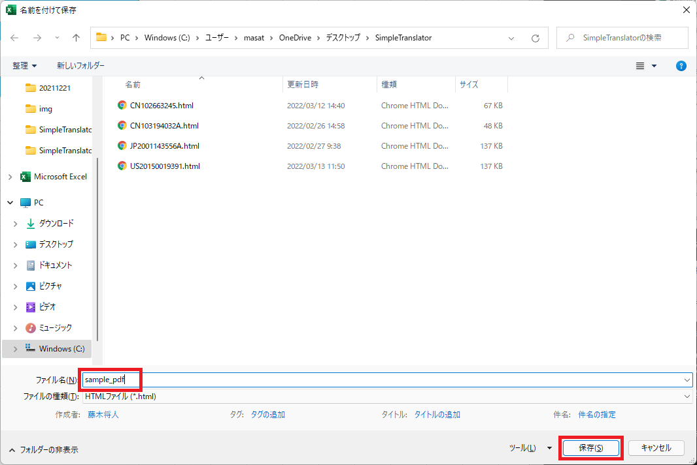

# SimpleTranslator(English translation tool)

[日本語 README はこちら][f]

I created a tool that can easily translate foreign words pasted into Excel using Selenium Basic and DeepL.

Setting up the environment is not easy, but once you are done setting up the environment, other than updating the Chrome Driver, there is no need to set up.

## ■ Background

I am currently working in a patent-related field and am using a search system to search for patent documents.

The patent documents that are output as search results are not only in Japanese but also in foreign languages such as English, and we sometimes read foreign language patent documents to understand the technical contents.

## ■ Theme

However, the translation accuracy of the translation tools provided is low, and it takes time to understand the translation results of foreign language patent documents.

## ■ Purpose

The idea is to provide a translation tool that can compare the translated text with the original text with high accuracy by displaying the original text in a foreign language and the translated text translated by DeepL side by side.

## ■ What you need

### OS

- Microsoft Windows 10

### Software

- Google Chrome
- Microsoft Excel 2016 or Microsoft Excel 2019
- Selenium Basic
- Chrome Driver

## ■ Setting up the environment to run Selenium Basic

If you have Selenium Basic installed and running, you do not need to do the following. Please proceed to the next step.

1. [Open the tutorial page on how to install SeleniumBasic and perform web scraping from Excel (VBA)][a].
2. Download and install Selenium Basic referring to [the above article][a].
3. Download the Chrome Driver by referring to [the article above][a], and then copy and overwrite the downloaded Chrome Driver to the folder where you installed Selenium Basic.
4. Check the operation of Selenium Basic referring to [the above article][a].
5. If the error occurs because ".Net Fremework 3.5" is not installed, refer to the link at [the bottom of the above article][a] to install.
6. If you are unable to install ".Net Fremework 3.5" at this point, perform the following step 7. 7.[How to install .NET3.5 on Windows 10! Install .Net Fremework 3.5 by referring to the page How to Install][b] . Net Fremework 3.5. Make sure to revert the changed registry values.

## ■ How to use Simple Translator

1. [1.SimpleTranslator zip file][e] ← Click to download.
2. Unzip the zip file downloaded in step 1 above, and open SimpleTranslator.xlsm in the SimpleTranslator folder.
3. Select the radio button to choose the display order of "Translated Text → Source Text" or "Source Text → Translated Text".

### How to use it in Web articles (For how to use it in patent documents and PDF, please skip this section and go to the following sections.)

4. Trace the English text displayed on [the sample page][c] with your mouse to copy it.

5. Right-click on sheet A2 in Excel, and select the second icon from the left under Paste Options.

6. Press the "Format button" to fill in the blank lines.

7. Press the "Translate (HTML)" button.

8. The "Save As" dialog box will appear.

9. Enter a name and save the file. In this case, enter "sample" and click the "Save button".

10. The translation will start and a progress bar will appear.

11. When the translation is complete, the browser will open and output the translation results.

12. The translation results will be created in HTML format in a directory in the same location as the application.

### Usage in patent documents

4. Enter the publication number of the public gazette you want to obtain in the text box on the upper right.

5. After entering the publication number, click the "Extract button".

6. After the text has been extracted, press the "Patent Formatting Button" to format the text.

7. Press the "Translate (HTML) button".

8. When the "Save As" dialog box appears, enter the publication number and click the "Save button".

9. The translation will start and a progress bar will appear, so wait a moment.

10. When the translation is complete, the browser will open and output the translation results.

11. The translation results will be created in HTML format in a directory in the same location as the application.

### How to use it with PDF files

4. Press the "Select PDF button".

5. When the "Select PDF to translate" dialog box appears, select the PDF you want to translate.

6. Select the PDF you want to translate, and then press the "OK button".

7. Wait for a while as the text extraction from the PDF starts.

8. When the extracted text is displayed, click the "Format button" to fill in the blanks.

9. Press the "Translate (HTML) button".

10. When the "Save As" dialog box appears, enter a name and save the file.

11. In this case, enter "sample_pdf" and click the "Save button".

12. The translation will start and a progress bar will appear, so wait a moment.

13. When the translation is complete, the browser will open and output the translation results.

14. The translation results will be created in HTML format in a directory in the same location as the application.

## ■ Caution

If Google Chrome is updated, Chrome Driver will no longer work.

In this case, please refer to [the above article][a] and overwrite the Chrome Driver that matches the version of Google Chrome.

## ■ Download page

1. [Selenium Basic](https://florentbr.github.io/SeleniumBasic/)
2. [Chrome Driver](https://chromedriver.chromium.org/downloads)

## ■ Reference page

1. [tutorial on how to install SeleniumBasic and perform web scraping from Excel (VBA)][a]
2. [How to install .NET3.5 on Windows 10!][b]
3. [sample][c]

[a]: https://lil.la/archives/3436
[b]: https://bgt-48.blogspot.com/2019/04/windows10net35.html
[c]: https://www3.nhk.or.jp/nhkworld/en/news/backstories/1622/
[e]: https://github.com/masatofujiki/SimpleTranslator/archive/refs/tags/v1.0.9.zip
[f]: https://github.com/masatofujiki/SimpleTranslator/blob/main/README_JA.md
