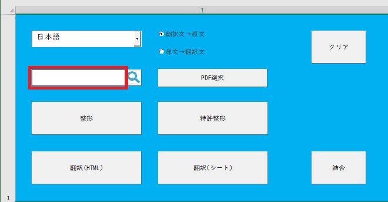
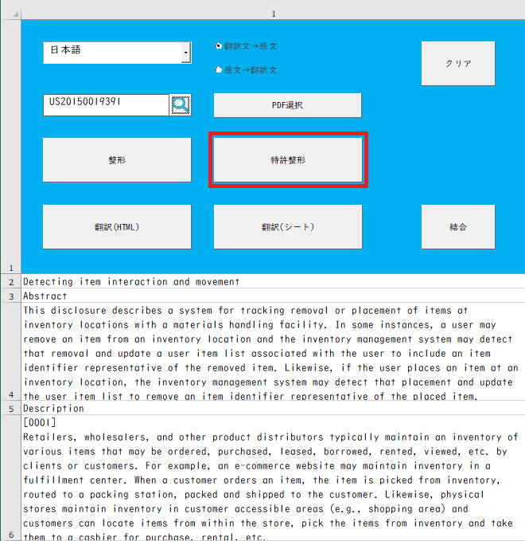
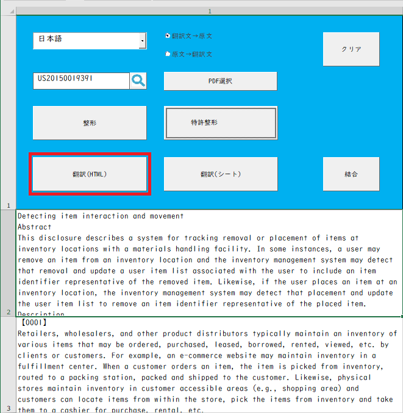
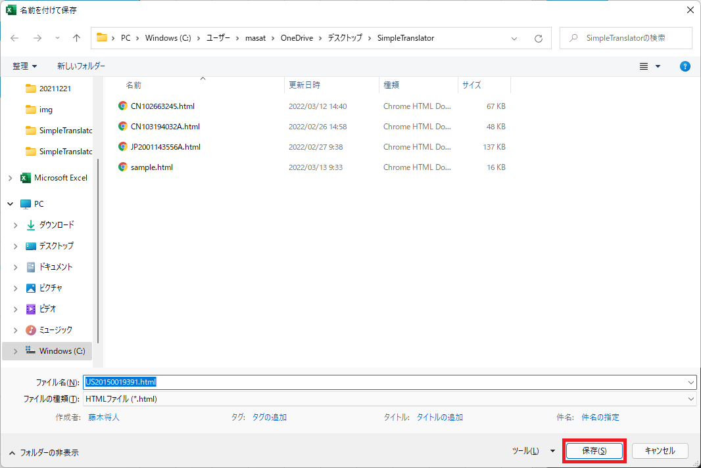
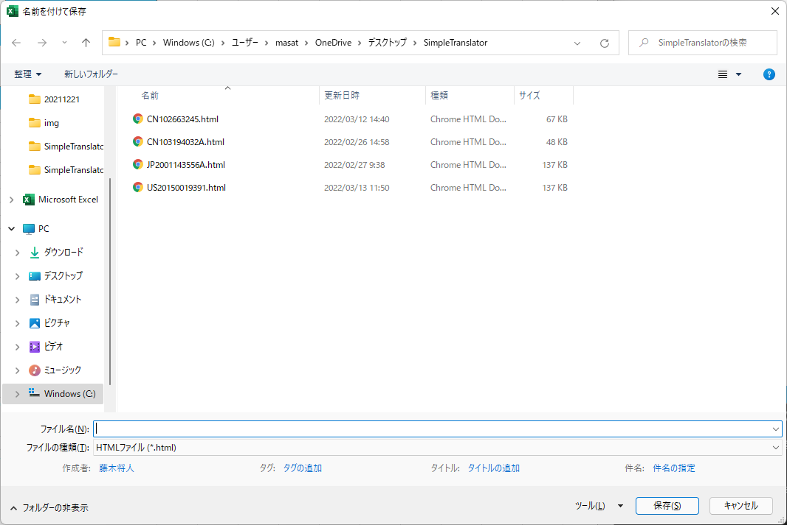
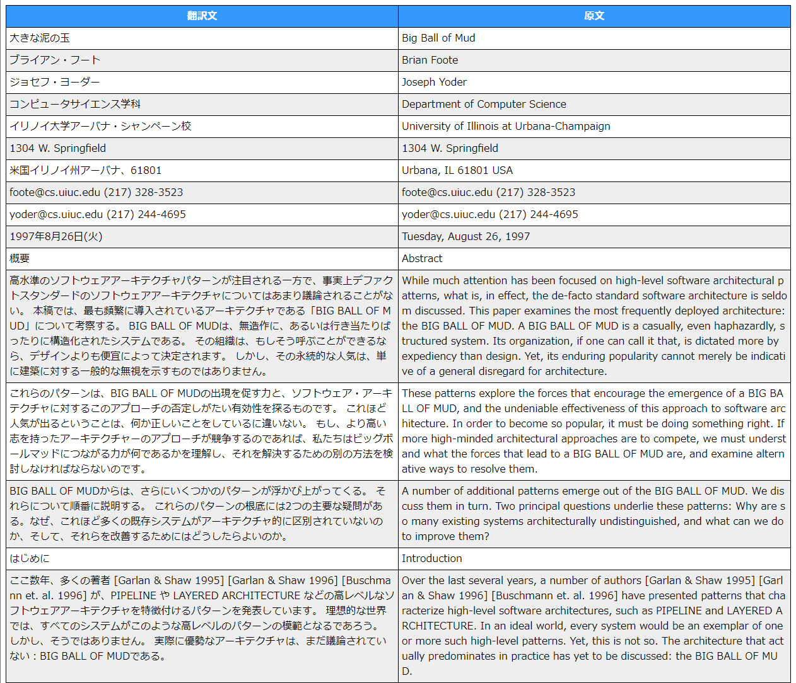

# SimpleTranslator(英語翻訳ツール)

[English README is here.][a]

[Selenium Basic 版はこちらをクリック][g]

Excel に貼り付けた外国語を Chrome Driver と DeepL でお手軽に翻訳してくれるツールを作りました。特別な環境設定は不要で Chrome Driver の更新も不要です。

## ■ 背景

現在は特許関連の仕事をしており、検索システムを利用して特許文献を検索しています。検索結果として出力される特許文献は日本語だけでなく英語などの外国語の特許語文献もあり、外国語の特許文献を読んで技術内容を理解することがあります。

## ■ 課題

外国語の特許文献の理解を補助するために検索システムには翻訳ツールが実装されていますが、用意された翻訳ツールの翻訳精度が低く、外国語の特許文献の翻訳結果を理解するのに時間が掛かります。

## ■ 目的

翻訳ツールを利用して外国語の原文と DeepL で翻訳した翻訳文とを並べて表示することにより、精度が高い翻訳文と原文とを比較できる翻訳ツールを提供することです。

## ■ 必要なもの

### OS

- Microsoft Windows 10 または Microsoft Windows 11

### ソフトウェア

- Google Chrome
- Microsoft Excel 2016 または Microsoft Excel 2019（Excel 2013、Excel 2021 は未確認）
- Chrome Driver

## ■Simple Translator の使い方

1. [SimpleTranslator の zip ファイル][b]← クリックしてダウンロードします。
2. 上記 1.でダウンロードした zip ファイルを解凍し、SimpleTranslator フォルダ内の SimpleTranslator.xlsm を開きます。
3. 言語選択コンボボックスを選択します。

   

4. 翻訳先の言語を選択します。

   

5. 表示順を「翻訳文 → 原文」「原文 → 翻訳文」のどちらにするかのラジオボタンを選択します。

   

### Web 記事での使い方(※特許文献での使い方、PDF での使い方はここを飛ばして以下の項目に進んでください。)

6. [サンプルページ][c]に表示された英文をマウスでなぞってコピーします。

   

7. Excel のシート A2 で右クリックし、「貼り付けのオプション」で左から 2 番目のアイコンを選びます。

   

8. 空白行を詰めるための「整形ボタン」を押します。

   

9. 「翻訳(HTML)ボタン」を押します。

   

10. 「名前を付けて保存」ダイアログが表示されます。

    

11. 名前を入力し保存します。ここでは「sample」と入力し「保存」ボタンを押します。

    

12. 翻訳が開始され、プログレスバーが表示されるのでしばらく待ちます。

    

13. 翻訳が完成するとブラウザが立ち上がり翻訳結果が出力されます。

    

14. 翻訳結果は HTML の形式でアプリケーションと同じ場所のディレクトリに作成されます。

### 特許文献での使い方

4. 右上のテキストボックスに取得したい公開公報の公開番号を入力します。

   

5. 公開番号を入力したら「抽出」ボタンを押します。

   

6. テキストが抽出された後、テキストを整形するために「特許整形ボタン」を押します。

   

7. 「翻訳(HTML)ボタン」を押します。

   

8. 「名前を付けて保存」ダイアログが表示されるので公開番号を入力し「保存ボタン」を押します。

   

9. 翻訳が開始され、プログレスバーが表示されるのでしばらく待ちます。

   

10. 翻訳が完成するとブラウザが立ち上がり翻訳結果が出力されます。

    

11. 翻訳結果は HTML の形式でアプリケーションと同じ場所のディレクトリに作成されます。

### PDF ファイルでの使い方

4. 「PDF 選択ボタン」を押します。

   

5. 「翻訳する PDF を選択してください」ダイアログが表示されるので翻訳対象の PDF を選択します。

   

6. 翻訳対象の PDF を選択した後「OK ボタン」を押します。

   

7. PDF からテキストの抽出が始まるのでしばらく待ちます。

   

8. 抽出したテキストが表示されるので「整形ボタン」を押して空白を埋めます。

   

9. 「翻訳(HTML)ボタン」を押します。

   

10. 「名前を付けて保存」ダイアログが表示されるので名前を入力し保存します。

    

11. ここでは「sample_pdf」と入力し「保存ボタン」を押します。

    

12. 翻訳が開始され、プログレスバーが表示されるのでしばらく待ちます。

    

13. 翻訳が完成するとブラウザが立ち上がり翻訳結果が出力されます。

    

14. 翻訳結果は HTML の形式でアプリケーションと同じ場所のディレクトリに作成されます。

## ■ 参考ページ

1. [サンプル][a]
2. [Excel VBA で SeleniumBasic を使わずにスクレイピングする][e]
3. [【Selenium】VBA でも WebDriver を自動で更新したい！][f]

[a]: https://github.com/masatofujiki/SimpleTranslator/blob/main/README.md
[b]: https://github.com/masatofujiki/SimpleTranslator/archive/refs/tags/v1.3.1.zip
[c]: https://www3.nhk.or.jp/nhkworld/en/news/backstories/1622/
[e]: https://qiita.com/uezo/items/66e20b064ffd5f239b9a
[f]: https://qiita.com/yamato1413/items/4b982aee46f28358fd39
[g]: https://github.com/masatofujiki/SimpleTranslator/blob/main/README_JA_OLD.md
